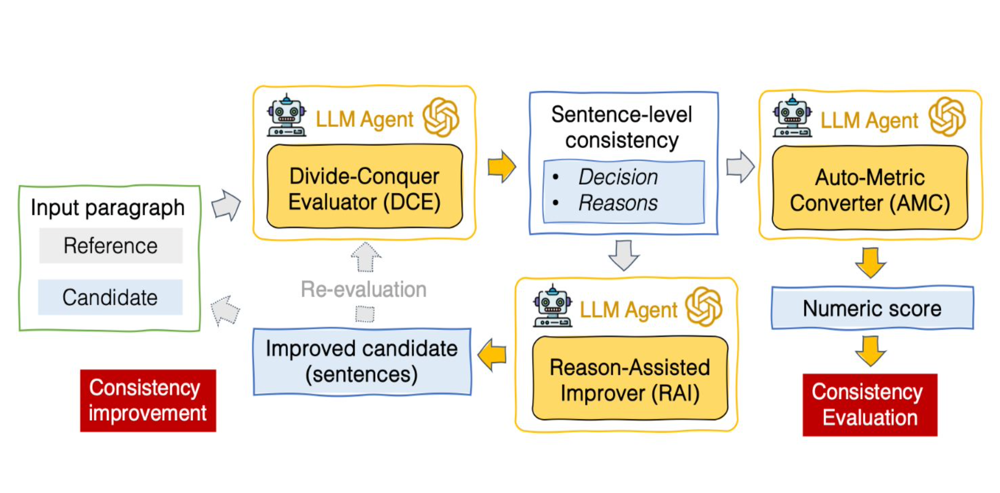
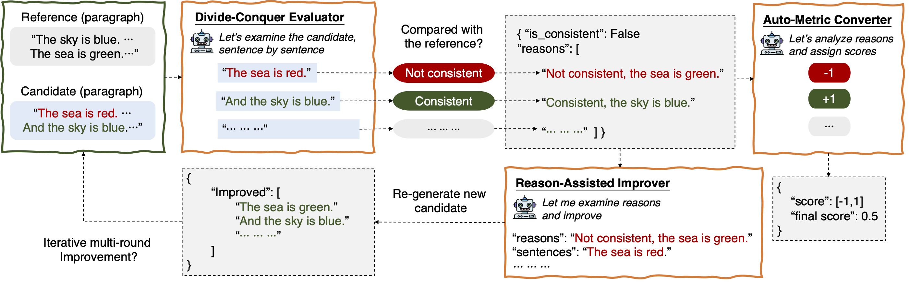

# DCR-Consistency: Evaluating and Improving Generation Consistency of Large Language Models via a Divide-Conquer-Reasoning Approach
[](#python)
[](https://raw.githubusercontent.com/intuit/email-decomposer/master/LICENSE)
[](https://codecov.io/gh/intuit-ai-research/DCR-consistency)
[](https://github.com/psf/black)

### 🤔 What is DCR-Consistency
DCR-Consistency is a novel framework that uses LLM agents to detect and mitigate inconsistencies, or in other words hallucinations. It takes advantage of LLM's power in semantic understanding while circumventing known pitfalls such as relatively poor performance in math.

Given a `reference` as the ground truth and a `candidate` to evaluate, it will output a numeric score between [0, 1] indicating its consistency where 0 means no sentence in the `candidate` is consistent and 1 otherwise. It also outputs a list of `reasons` about why this score is generated. Better yet, based on such `reasons`, it can improve the `candidate` and mitigate detected inconsistencies. 



It composes of three parts:

* DCE takes a `reference` and a `candidate`, evaluates the consistency between the two on a sentence level, and outputs a list of `reasons` on the consistency check for each sentence in the `candidate`.
* AMC takes the output of DCE and convert it to a numeric score between [0, 1]
* RAI takes the `reasons` output of DCE and generates improved versions that mitigate detected inconsistencies.




### 🤖 Installation

* Ensure you have python >= 3.9
* Clone this repo and install with

```
pip install . 
```

DCR-Consistency can also be installed directly from pip(coming soon!)
```
pip install dcr-consistency
```

### 🚀 Quickstart
The easiest way to start is to play with the example in `examples/example.py`. To do so:

* Install the DCR-Consistency package with steps above
* Install the necessary packages with command below (example use additional dependencies such as openai):
```
pip install -r examples/requirements_example.txt
```
* update the `api_key` variable with your apikey.
* run the example with
```
python examples/example.py
```


### 📃 Usage
#### Evaluation
```
res = evaluate(_your_LLM_, _your_model_config_, data, worker_count=5)
```

* **_your_LLM_**: This will be your own object that handles communication with LLM. It should follow the contract of [LLM](https://github.com/intuit-ai-research/DCR-consistency/blob/main/dcr/components/llm.py) abstract class. This allows freedom of using whatever LLM you desire. An example can be found [here](https://github.com/intuit-ai-research/DCR-consistency/blob/716a802d58e92b4f0ce5f9e5303bb713737d3676/examples/example.py#L11)
* **_your_model_config_**: This will be whatever parameter your LLM needs. An example can be found [here](https://github.com/intuit-ai-research/DCR-consistency/blob/716a802d58e92b4f0ce5f9e5303bb713737d3676/examples/example.py#L32)
* **worker_count**: This configures the number of threads to run the program
* **data**: The `data` filed will be a list of data to run. By default each item in it should be a dict containing fields `id`, `reference` and `candidate`. The returned item will be the original data passed in joined with the columns below:

| column  | meaning   |
|-------------|:------------|
|  id | Unique Identifier for each row | 
|  score | Final consistency score of the row | 
| dce_reasons | Reasons for the final score given by DCE| 
| amc_reasons | Reasons for scoring of each sentence given by AMC | 
|  dce_raw | Raw data from DCE | 
| amc_raw | Raw data from AMC | 
|  decision | Consistency decision based on DCE | 

#### Inconsistency Mitigation
```
res = improve(_your_LLM_, _your_model_config_, data, worker_count=5)
```

* **_your_LLM_**: This will be your own object that handles communication with LLM. It should follow the contract of [LLM](https://github.com/intuit-ai-research/DCR-consistency/blob/main/dcr/components/llm.py) abstract class. This allows freedom of using whatever LLM you desire. An example can be found [here](https://github.com/intuit-ai-research/DCR-consistency/blob/716a802d58e92b4f0ce5f9e5303bb713737d3676/examples/example.py#L11)
* **_your_model_config_**: This will be whatever parameter your LLM needs. An example can be found [here](https://github.com/intuit-ai-research/DCR-consistency/blob/716a802d58e92b4f0ce5f9e5303bb713737d3676/examples/example.py#L32)
* **worker_count**: This configures the number of threads to run the program
* **data**: The `data` filed will be a list of data to run. By default each item in it should be a dict containing fields `id`, `article` and `sentences`. `article` is the reference. `sentences` is a list illustrating whether each sentence is or is not consistent compared to the reference and the reasons. The returned item will be the original data passed in joined with the columns below:

| column  | meaning   |
|-------------|:------------|
|  id | Unique Identifier for each row | 
|  improved_version | The improved version where inconsistency is mitigated | 
| rai_raw | Raw data from RAI| 

### 👏Contributing

See [CONTRIBUTING.md](https://github.com/intuit-ai-research/DCR-consistency/blob/main/CONTRIBUTING.md).


### 💁Citation 

```
@inproceedings{cui2023dcr,
      title={A Divide-Conquer-Reasoning Approach to Consistency Evaluation and Improvement in Blackbox Large Language Models},
      author={Wendi Cui, Jiaxin Zhang, Zhuohang Li, Damien Lopez, Kamalika Das, Bradley Malin, Sricharan Kumar},
      booktitle={NeurIPS 2023 Workshop on Socially Responsible Language Modelling Research},
      year={2023},
      primaryClass={cs.CL}
}
```
